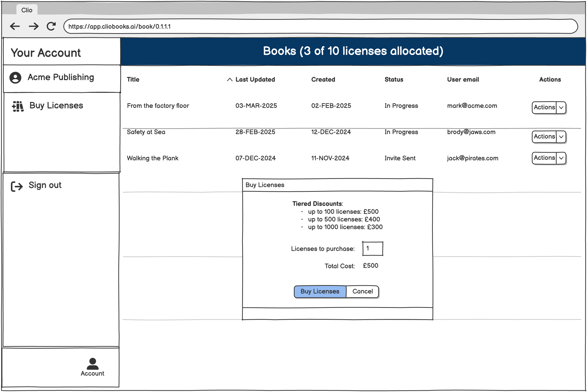

# cliobooks-tech-assign

Technical Assignment for ClioBooks Software Engineer Candidates.

## Purpose

The purpose of this test is to ascertain your skills and competencies using some of the technology stack 
you will utilise at ClioBooks.

Whilst we are obviously not adverse to using AI as an assistant during coding we are not looking for AI
generated submissions. In a subsequent interview you will be asked to walk through, discuss and
demonstrate your solution.

The focus of this test is to ascertain your front-end skills using React and Typescript. Feel free to 
use supporting technologies as you see fit.

Engineers comfortable working in the full stack are welcome to develop a lightweight server, 
but this is not required.

Front-end developers should write a utility file containing API functions that simulate calling the back-end.

Please focus on quality of code rather than coverage.

## Project structure

Fork this repository and clone it to your local machine.

Create a new branch for your work of the form `feature/surname-firstname`.

Complete your work in this branch. Do not create a pull request for this branch back to the main repository,
unless instructed.

## Requirements

You are to implement a book dashboard and license purchase feature for a fictional publisher.

### Main View

The home page when opening the application should display a blank area where the dashboard will be rendered
when the user clicks the `Book Dashboard` button.

On the left-hand side of the application you should provide a sidebar with three functional buttons:
- `Acme Publishing` should include the name of the publisher and when clicked should take the user back 
   to the home page.
- `Book Dashboard` should display the dashboard.
- `Buy Licenses` should display a License Purchase modal.

### Dashboard

The dashboard consists of a table with the following columns:
 - Book Title
 - Last Updated
 - Created
 - Status
 - User Email
 - The Actions drop-down button should have two options: `Assign License` and `Return License`.

These are the features you should implement for the table:
 - The columns of the table should be sortable.
 - The table should include optional pagination in groups of 10.

The data displayed on the dashboard should be retrieved from an API (or mocked API) containing book
information in JSON format.

At the top of the dashboard should be a summary of the licenses assigned to books. This should initially
be 0.

### License Purchase

When the user clicks the `Buy Licenses` button they should be presented with a modal dialog that allows
them to select the number of licenses they wish to purchase.

The model should display a table, retrieved from an API (or mocked API) containing tiered discounts in 
JSON format. 

As they select a number of licenses the application should automatically update the total cost of the 
licenses based on the tiered pricing structure.

When they submit the dialog they should be presented with a confirmation dialog that allows them to 
confirm the purchase. Once confirmed the application should make a call to an asynchronous API to 
purchase the licenses. The application should poll for a purchase status response from the API until 
the licenses are purchased. Simulate this delay to be around 5 seconds. The API should simulate a random
failure status 50% of the time.

If the licenses are purchased successfully the application should display a success message and close
the dialog.

If the licenses are not purchased successfully the application should display an error message and allow
the user to retry.

The total number of licenses purchased should be updated via the publisher API and 
displayed in the dashboard summary.

### Assign License and Return License

Clicking the `Assign License` button in the book actions dropdown should display a confirmation/cancel.
If confirmed a license should be assigned to the book from the publisher's license pool. 
The book and should updated via the book API, and the assigned license count updated via the publisher API.

Clicking the `Return License` button in the book actions dropdown should display a confirmation/cancel.
If confirmed a license should be returned to the publisher's license pool. The book should be updated
via the book API, and the assigned license count updated via the publisher API.

### APIs

Implement (or mock) the following APIs:

**Publisher API**: this API is used to retrieve information about the publisher and their purchased licenses.

**Book API**: this API is used to retrieve information about books and their license status.

**License Purchase API**: this API is used to purchase licenses.

**License Pricing API:** this API is used to retrieve the pricing structure for licenses.

## Things to consider

Your submission should consider the following points, with reference to the job specification where
applicable:

 - Code Quality and Best Practices
 - State management
 - Component life cycle and side effects handling
 - Performance
 - Component Styling
 - Testing & Debugging
 - Accessibility & UX
 - Build tools
 - API Integration (optional)

You may want to provide suggestions on how to improve the UI/UX of the application.

## Submission

When you have finished your submission please upload it to GitHub and provide a link via email to
[mark@cliobooks.ai](mailto:mark@cliobooks.ai).

Your should create a top-level `INSTALL.md` file that should provide instructions on how to run the 
application, run tests as applicable, and any other information you would like to share.

